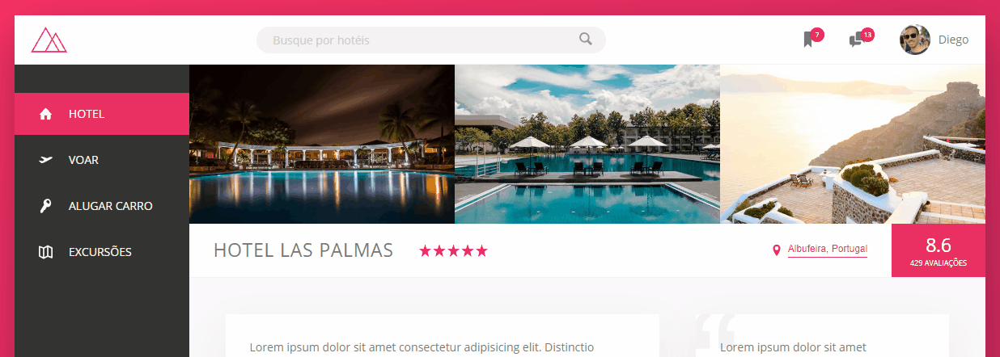

# Projeto - Trillo Hotel

---

 

> Este projeto foi realizado em acompanhamento ao curso ministrado dentro da plataforma Udemy, cujo seu idealizador é [Jonas Schmedtmann](https://twitter.com/jonasschmedtman). Clique na imagem para visualizar o site.

## Descrição

 O objetivo principal com este projeto é a masterização do módulo CSS dedicado para layout de páginas, Flexbox. Foram apresentadas e aplicadas as principais funcionalidades deste, além disso, houve o uso de outras tecologias complementares para a construção desta página, que é a simulação de uma empresa que faz comparação e reserva de hotéis.

## Caracteristicas

- Site responsivo
- Animações interativas

## Tecnologias

- Pré-processador SASS.
- Gerenciador de dependências npm/yarn.
- Gulp - para automação de prefixos e minificação de css e imagens.
- Versionamento de código.
